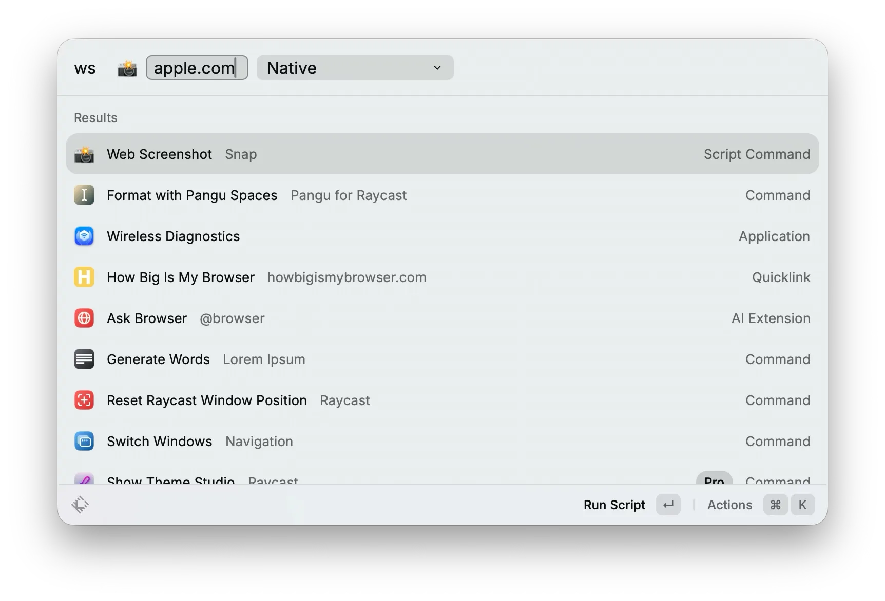

# Web Screenshot

A personal screenshot tool for webpages that handles tricky scroll-based animations. Built with Node.js, Playwright, and Sharp. Runs smoothly as a Raycast script command.

## Features

- Full-page capture (native & stitched methods)
- AVIF output with 80% quality (~50-70% smaller than PNG)
- Automatic protocol detection (http/https)
- Configurable wait strategies (domcontentloaded, load, networkidle)
- Selector-based waiting for dynamic content
- Retina/HiDPI support (2x resolution)

## Usage

```bash
# Basic usage
./web-screenshot.sh example.com

# With Stitched method (for animated/lazy-loaded pages)
./web-screenshot.sh example.com stitched

# Wait for network idle
./web-screenshot.sh example.com native --wait=networkidle

# Wait for specific element
./web-screenshot.sh example.com --wait-for=".postArticle"
```

## Requirements

- Node.js 24+
- Playwright
- Sharp
- macOS with [Raycast Script Commands](https://github.com/raycast/script-commands)

## Configuration

### Output Location

Default: `~/Downloads`

Modify `snap.js` line 93 to change:
```javascript
// Change 'Downloads' to 'Desktop' or any other path
os.homedir(), 'Downloads'
```

### Wait Strategies

| Strategy | Description |
|----------|-------------|
| `domcontentloaded` | Start capture when DOM is ready (default) |
| `load` | Wait for full page load |
| `networkidle` | Wait for network to be idle |

## Architecture

- **snap.js**: Core logic (Playwright + Sharp)
- **web-screenshot.sh**: [Raycast Script Command](https://github.com/raycast/script-commands)
